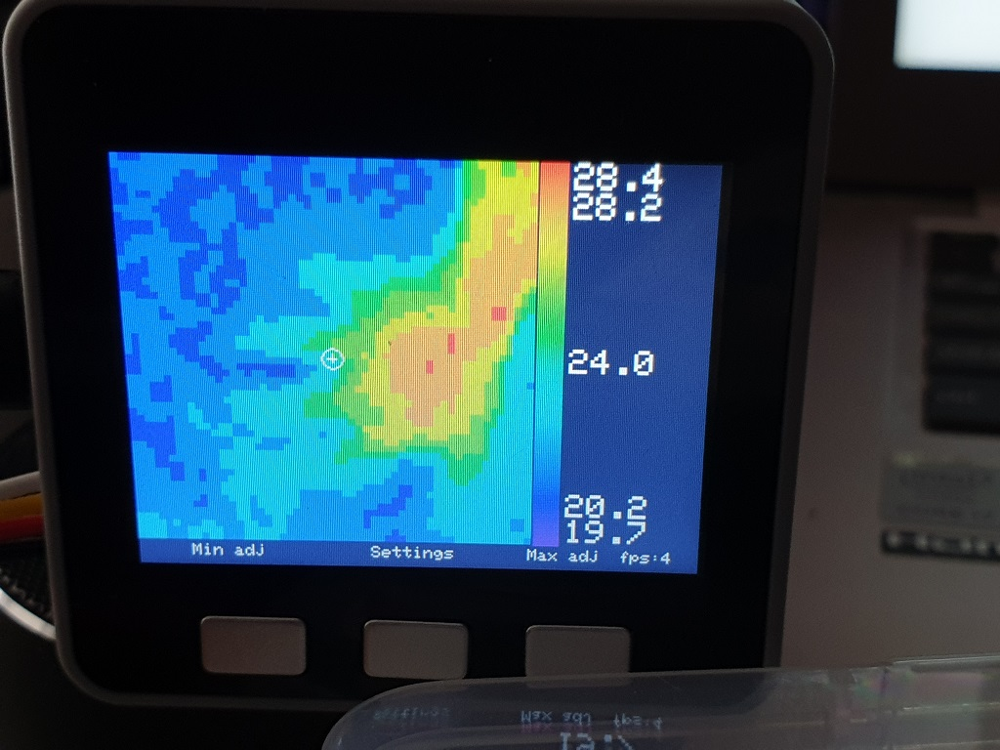

# M5Stack-Thermal-MLX90640
Improved version of Thermal unit:

* Flickerless display (using Sprite)
* Rearranged UI
* Battery level
* Autoscale temperatures (can be toggled on/off)
* interpolate to 56x56 (capable of 112x112, but with 1fps)
* averaged 4x4 spot temperature
* display temperature grid (can be toggled on/off)
* moved to PlatformIO project (rename main.cpp to main.ino for Arduino IDE)
* cleaned up the code

BtnA adjusts MIN temp:
* short press -1C
* long press -5C

BtnC adjusts MAX temp:
* short press +1C
* long press +5C

BtnB:
* short press sets MIN/MAX temp to current min/max
* long press invokes menu:
  * BtnA - toggle temperature grid
  * BtnB - toggle auto scale
  * BtnC - Power Off
